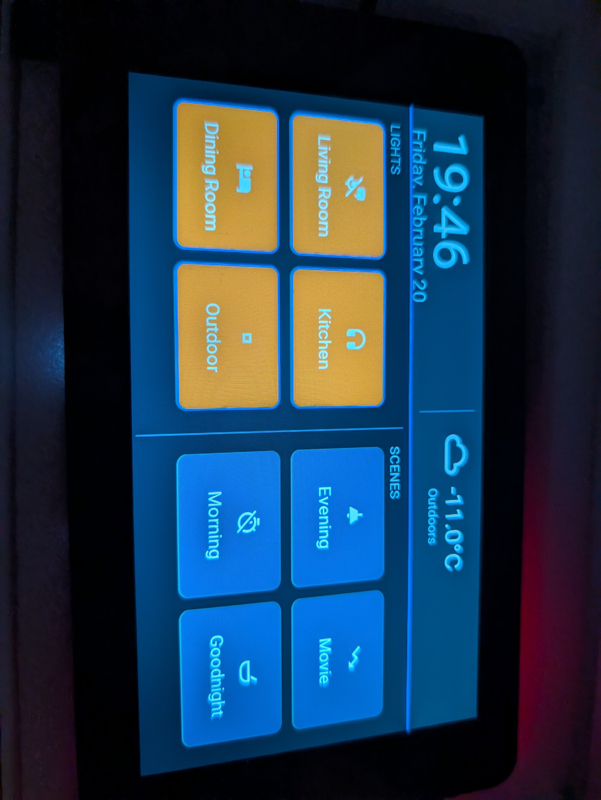

# Waveshare ESP32-S3 7" Touch LCD — Home Assistant Dashboard

ESPHome firmware for the [Waveshare ESP32-S3 7" Capacitive Touch LCD](https://www.waveshare.com/esp32-s3-touch-lcd-7.htm) (800×480, 8MB flash, 8MB PSRAM) running a Home Assistant control panel.



## Features

- **Clock & date** — synced from Home Assistant
- **Weather** — live condition icon + outdoor temperature from HA sensors
- **4 light toggles** — with real-time on/off state sync (amber when on)
- **4 scene buttons** — optimistic radio-button highlighting (last activated stays orange)
- **Dark theme** — easy on the eyes, designed for wall-mounted always-on use

## Layout

```
800×480 landscape
┌─────────────────────────────────────────────────────────────────────────┐
│  🕐 19:46              │  🌤  -11.0°C                                   │  header
│  Friday, February 20   │     Outdoors                                   │  110px
├─────────────────────────────────────────────────────────────────────────┤
│  LIGHTS                        SCENES                                   │
│  ┌──────────┐ ┌──────────┐    ┌──────────┐ ┌──────────┐                │
│  │  🛋       │ │  🍳       │    │  🌅       │ │  📺       │                │
│  │Living Rm │ │ Kitchen  │    │ Evening  │ │  Movie   │                │
│  └──────────┘ └──────────┘    └──────────┘ └──────────┘                │
│  ┌──────────┐ ┌──────────┐    ┌──────────┐ ┌──────────┐                │
│  │  🍴       │ │  🌳       │    │  ☀️       │ │  🛏       │                │
│  │Dining Rm │ │ Outdoor  │    │ Morning  │ │Goodnight │                │
│  └──────────┘ └──────────┘    └──────────┘ └──────────┘                │
└─────────────────────────────────────────────────────────────────────────┘
```

## Hardware

| Component | Detail |
|-----------|--------|
| Board | Waveshare ESP32-S3-Touch-LCD-7 |
| Display | 800×480 RGB parallel (rpi_dpi_rgb) |
| Touch | GT911 capacitive, I²C |
| IO Expander | CH422G (backlight, LCD reset, touch reset) |
| Flash | 8 MB |
| PSRAM | 8 MB (octal) |

## Known Issues & Fixes

### RGB LCD DMA starves WiFi (critical)

The ESP32-S3 RGB parallel display uses continuous DMA transfers that can monopolize the memory bus, preventing the WiFi WPA handshake from completing. Symptoms: `reason='Auth Expired'` or `reason='Association Expired'` in logs, WiFi never connects.

**Fix applied in this config:**
- `pclk_frequency: 14MHz` (reduced from typical 16MHz)
- IRAM optimization sdkconfig flags (`CONFIG_LCD_RGB_ISR_IRAM_SAFE`, `CONFIG_ESP_WIFI_IRAM_OPT`, etc.)
- `power_save_mode: NONE` on WiFi
- LVGL `buffer_size: 15%` (reduced PSRAM contention)

If WiFi still won't connect, try lowering `pclk_frequency` to `12MHz` or `10MHz`.

### Touch not registering on LVGL buttons

LVGL buttons require `clickable: true` to be set explicitly, and the page needs `scrollable: false`. Without these, LVGL interprets taps as scroll gestures.

### USB serial logging

The ESP32-S3 uses native USB-Serial-JTAG, not a traditional UART. The logger must be configured with:
```yaml
logger:
  hardware_uart: USB_SERIAL_JTAG
```

## Quick Start

### 1. Clone and configure

```bash
git clone https://github.com/YOUR_USER/waveshare-esp32s3-dashboard.git
cd waveshare-esp32s3-dashboard
cp secrets.yaml.template secrets.yaml
```

Edit `secrets.yaml` with your WiFi credentials and HA API key.

### 2. Customize entities

Open `entrance-panel.yaml` and replace every `# ← REPLACE` entity ID with your actual Home Assistant entities:

| Config Entity | What to Replace With |
|---------------|---------------------|
| `weather.candiac_forecast` | Your weather integration entity |
| `sensor.feels_like` | Any temperature sensor |
| `light.living_room_light` | Your living room light entity |
| `light.kitchen_light` | Your kitchen light entity |
| `light.dining_room_light` | Your dining room light entity |
| `light.front_door_light` | Your outdoor light entity |
| `script.evening_scene` | Your evening script/scene |
| `script.movie` | Your movie script/scene |
| `script.day_scene` | Your morning script/scene |
| `script.house_off` | Your goodnight script/scene |

### 3. Flash

**First flash** (USB-C cable required):
```
esphome run entrance-panel.yaml
```

**Subsequent updates** are done via OTA (wireless).

### 4. Enable HA service calls

In Home Assistant:
1. Go to **Settings → Devices & Services → ESPHome**
2. Click **Configure** on the entrance-panel device
3. Enable **"Allow the device to make Home Assistant service calls"**

Without this, button presses will register but won't toggle anything.

## Customization

### Adjusting pixel clock

If WiFi is unreliable, lower `pclk_frequency`. If the display flickers or shows color banding, raise it:

| pclk_frequency | Display | WiFi |
|---------------|---------|------|
| 16 MHz | ✅ Perfect | ❌ Auth failures |
| 14 MHz | ✅ Good | ✅ Stable |
| 12 MHz | ✅ Good | ✅ Stable |
| 10 MHz | ⚠️ Slight flicker possible | ✅ Stable |
| 8 MHz | ❌ Color cycling | ✅ Stable |

### Adding more buttons

The layout uses absolute positioning. The grid cells are:
- **Light buttons:** 168×130 px, starting at `(24, 150)` with 182px horizontal / 146px vertical spacing
- **Scene buttons:** 168×130 px, starting at `(424, 150)` with 182px horizontal / 146px vertical spacing

### Changing colors

Edit the `color:` section. Key colors:
- `col_btn_on` — active light/scene button (default: amber `D97706`)
- `col_scene_btn` — inactive scene button (default: dark blue `1E3A5F`)
- `col_accent` — header accent line and active borders (default: blue `3B82F6`)

## Debugging

Set logger to DEBUG for troubleshooting:
```yaml
logger:
  level: DEBUG
  hardware_uart: USB_SERIAL_JTAG
```

Set LVGL to VERBOSE for touch/widget issues:
```yaml
lvgl:
  log_level: VERBOSE
```

## License

MIT
